### Rewara

A B2B SaaS platform that provides businesses with a comprehensive dashboard to analyze customer engagement, manage loyalty programs, collect and act on feedback, and improve customer satisfaction through data-driven insights.

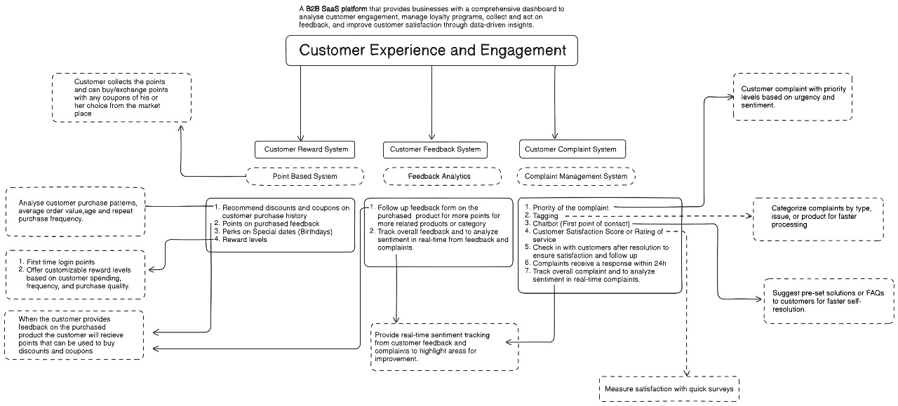

#### Screenshots

| 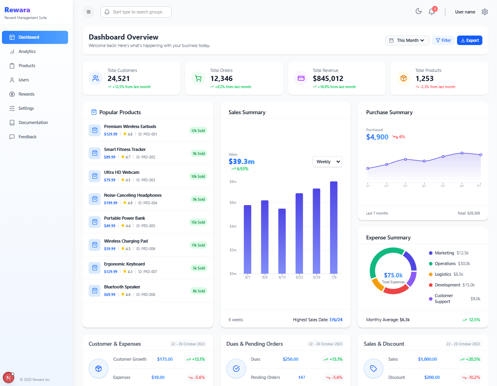           |    |
| ---------------------------------------------- | ------------------------------------ |
| 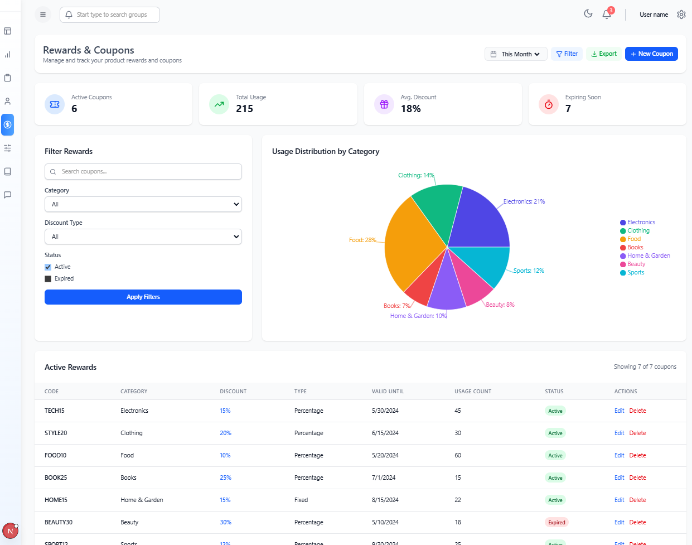               | 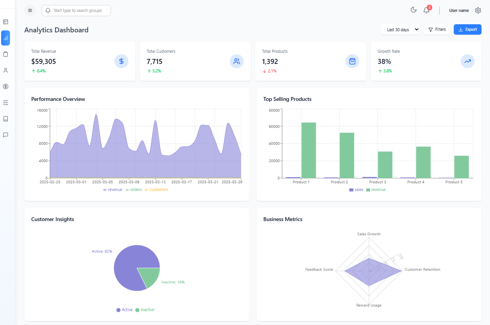 |
| 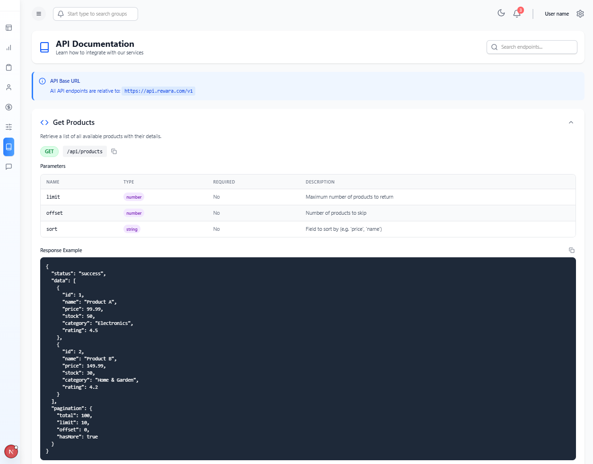 | 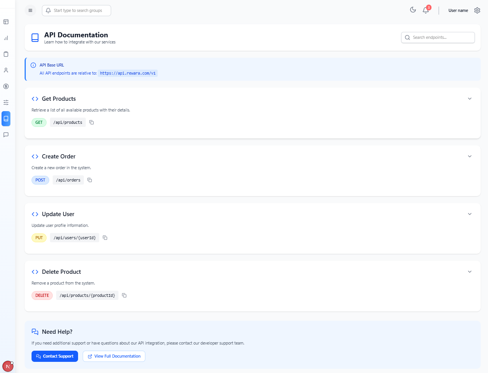         |
| 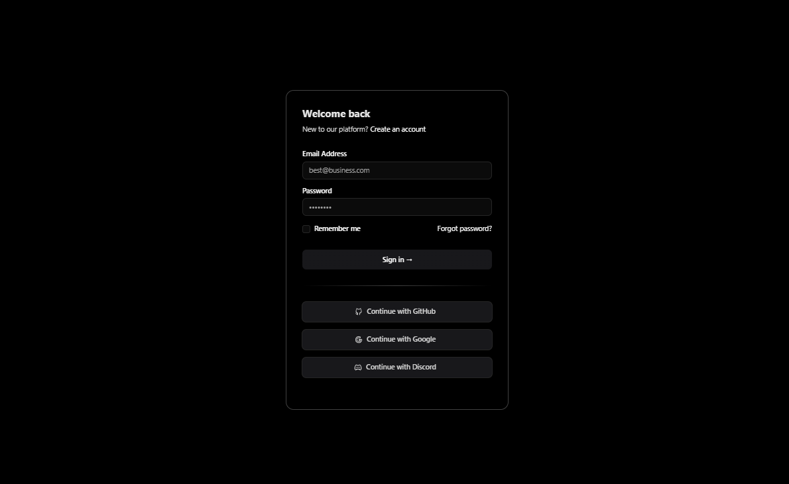                   | 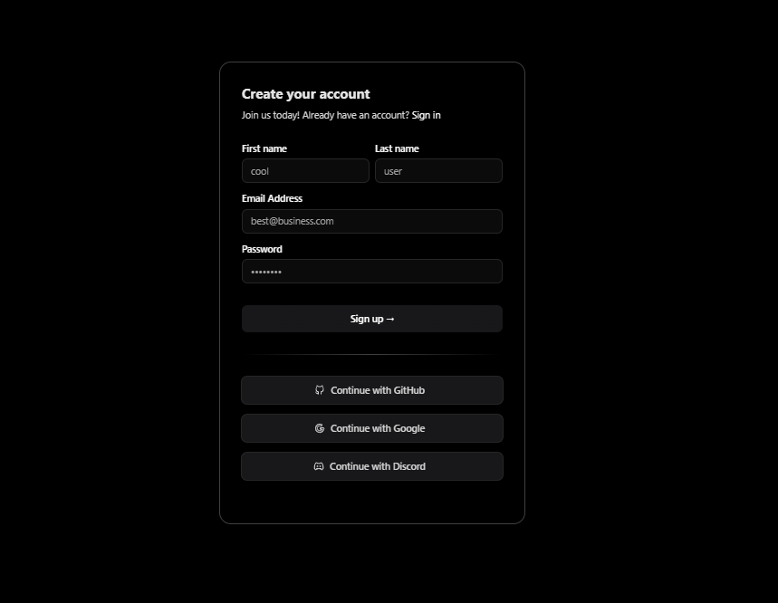       |
| 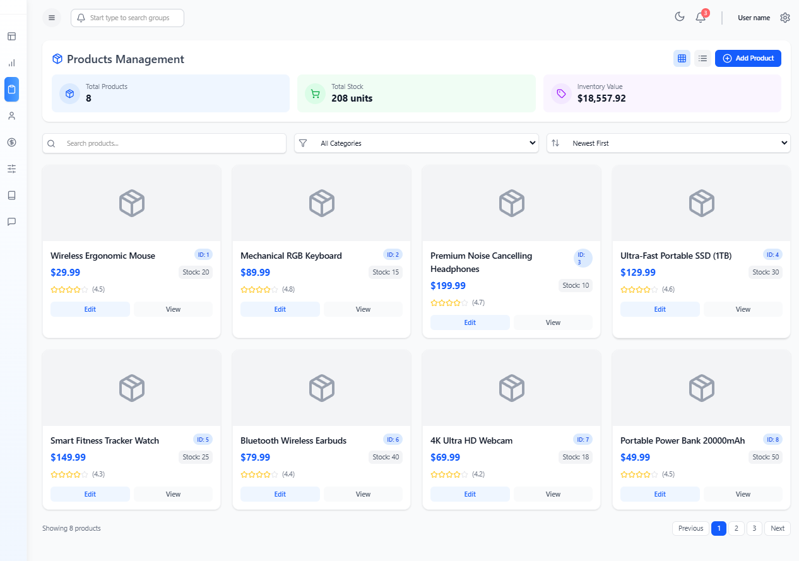             |    |
| 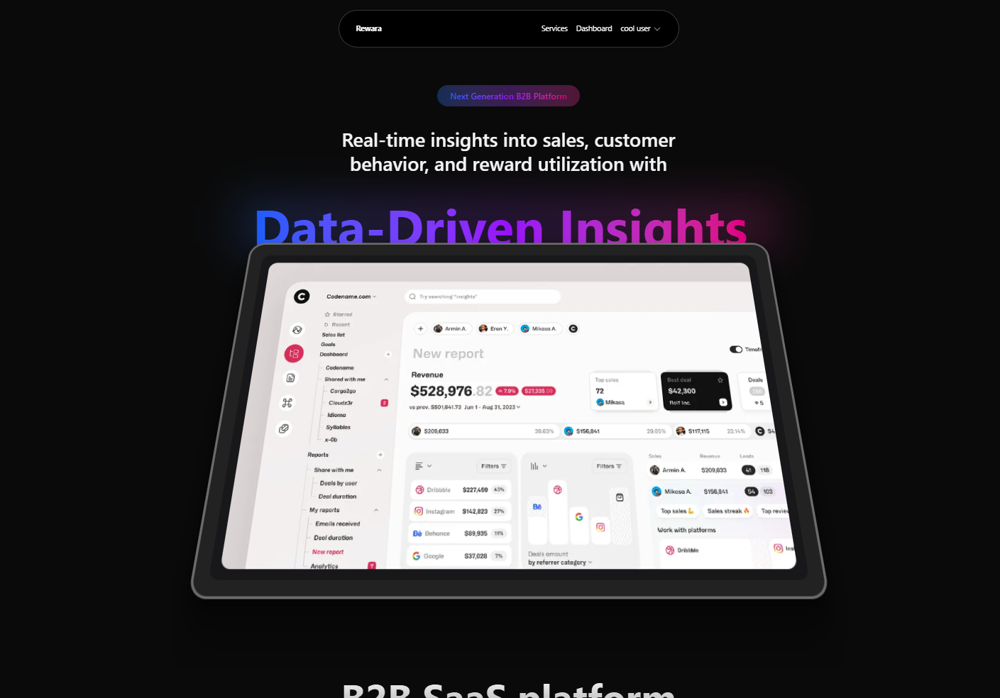               | 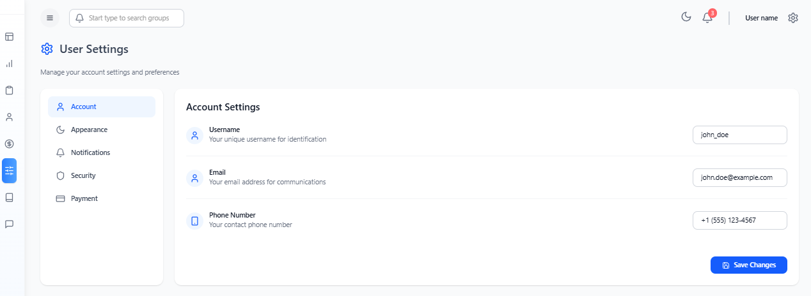   |

#### Local Development

```bash
# Clone the repository
git clone https://github.com/parazeeknova/rewara.git

# Install dependencies
pnpm i or pnpm install

# Lint or format code (optional)
pnpm lint or pnpm format

# Setup environment variables (development)
pnpm run env:dev

# Start the development server (docker)
pnpm run docker:dev
# Run prisma migrations
pnpm run prisma:up

# Copy envs to .env
cp .env.example .env

# Start the development server
pnpm dev
```
