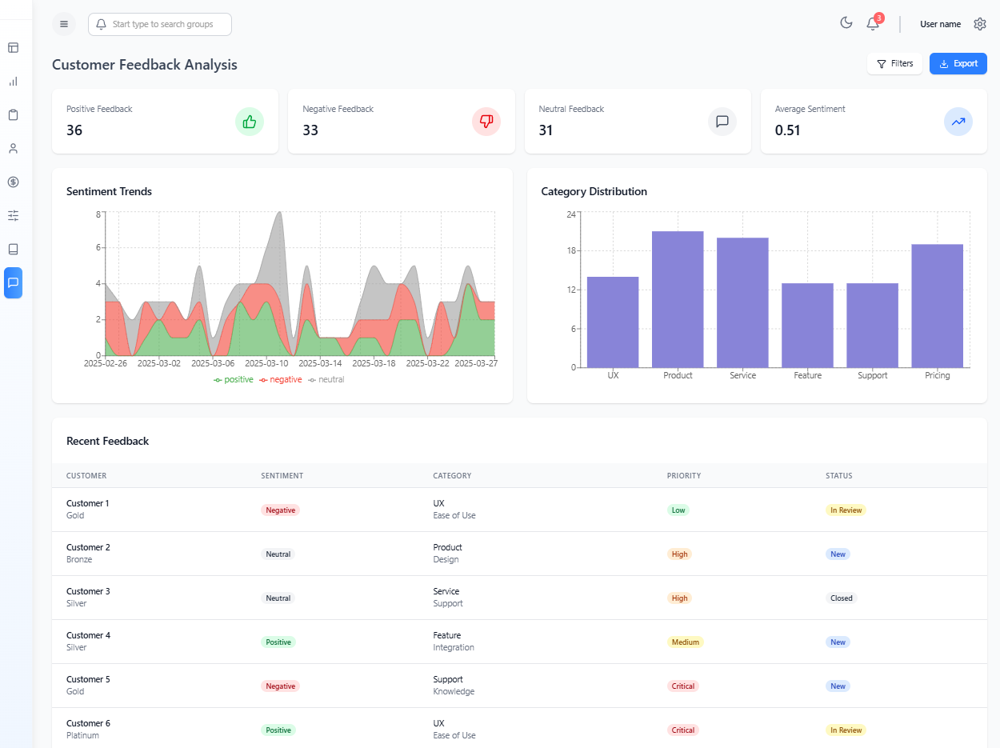

### Rewara

A B2B SaaS platform that provides businesses with a comprehensive dashboard to analyze customer engagement, manage loyalty programs, collect and act on feedback, and improve customer satisfaction through data-driven insights.


> [!NOTE]
> Rewara is a hackathon project built under 6 hours. The project is not production-ready and lacks many features. Uses mock data for analytics and rewards. If i get time, i will implement the missing features.

#### Screenshots

| Dashboard                            | Rewards                          | Feedback                           |
| ------------------------------------ | -------------------------------- | ---------------------------------- |
|  |  |  |

| Analytics                            | API Docs Expanded                              | API Docs                     |
| ------------------------------------ | ---------------------------------------------- | ---------------------------- |
|  |  |  |

| Login                        | Signup                         | Settings                           |
| ---------------------------- | ------------------------------ | ---------------------------------- |
|  |  |  |

| Products                           | Landing                          |
| ---------------------------------- | -------------------------------- |
|  |  |

#### Local Development

```bash
# Clone the repository
git clone https://github.com/parazeeknova/rewara.git

# Install dependencies
pnpm i or pnpm install

# Lint or format code (optional)
pnpm lint or pnpm format

# Setup environment variables (development)
pnpm run env:dev

# Start the development server (docker)
pnpm run docker:dev
# Run prisma migrations
pnpm run prisma:up

# Copy envs to .env
cp .env.example .env

# Start the development server
pnpm dev
```
